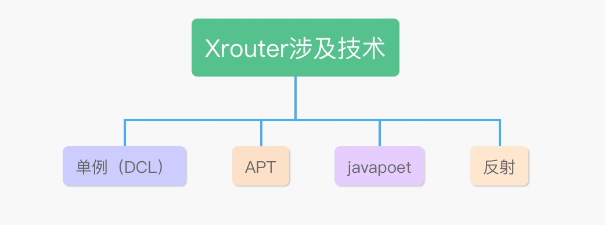
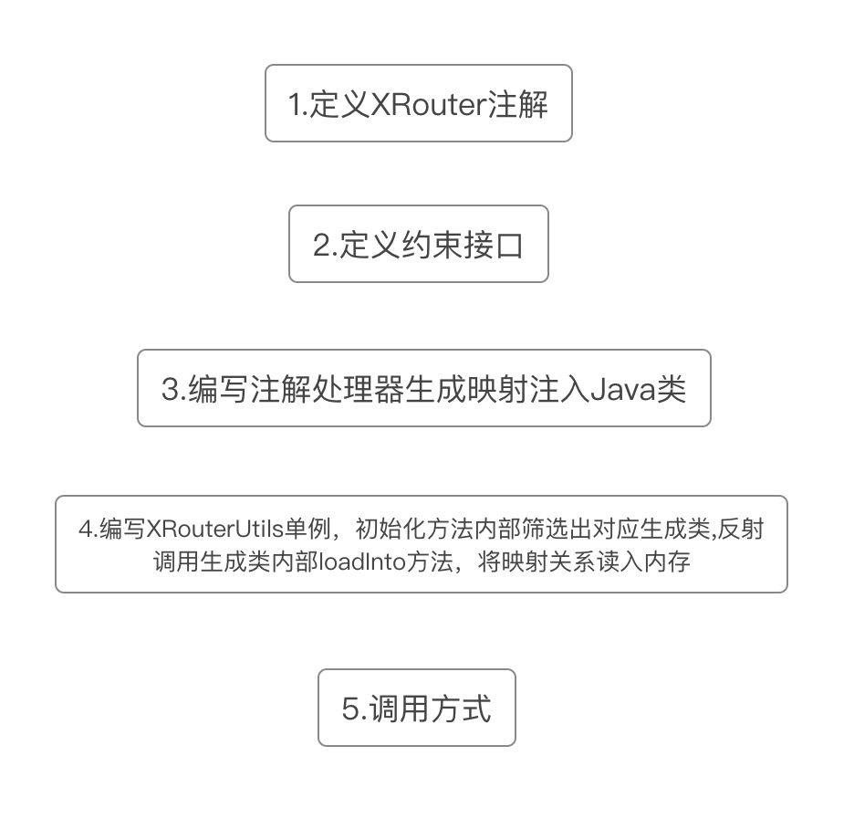

##「必知必会」Android-XRouter(简易版Arouter)


<!--more-->



###1.定义XRouter注解
```java
@Target({ElementType.TYPE}) // 作用目标接口，类，枚举
@Retention(RetentionPolicy.CLASS) //注解会在class字节码文件中存在，但运行时无法获得
public @interface XRouter {
    String path() default ""; //参数
}
```

###2.定义约束接口
```
//定义约束接口，生成的类文件需要继承该接口，方便后续筛选
public interface XRouterInterface {
    void loadInto(Map<String, String> xRouteMap);
}
```

###3.编写注解处理器生成映射注入Java类
```
/**
 * 这个注解是必须的，不加的话在build的时候会找不到该注解处理器
 */
@AutoService(Processor.class)
public class XRouterProcessor extends AbstractProcessor {

    private Elements elementUtils;
    private Filer filer;

    @Override
    public synchronized void init(ProcessingEnvironment processingEnv) {
        super.init(processingEnv);
        elementUtils = processingEnv.getElementUtils();
        filer = processingEnv.getFiler();
    }

    /**
     * 该方法用于指定该注解处理器出路哪些注解
     *
     * @return
     */
    @Override
    public Set<String> getSupportedAnnotationTypes() {
        return Collections.singleton(XRouter.class.getCanonicalName());
    }

    /**
     * 用于指定java版本
     *
     * @return
     */
    @Override
    public SourceVersion getSupportedSourceVersion() {
        return SourceVersion.RELEASE_8;
    }


    @Override
    public boolean process(Set<? extends TypeElement> annotations, RoundEnvironment roundEnv) {

        Boolean shouldGenerateFile = false; // 是否生成文件
        String targetClassName = ""; // 生成文件名
        String packageName = ""; // 包名

        List<XRouteBean> routeList = new ArrayList(); // 映射关系存储列表

        Set<? extends Element> elements = roundEnv.getElementsAnnotatedWith(XRouter.class);

        for (Element element : elements) {
            if (element instanceof TypeElement) {
                if (element instanceof TypeElement) {
                    shouldGenerateFile = true;
                    if (targetClassName.isEmpty()) {
                        targetClassName = "XRouter$$" + element.getSimpleName(); // 生成文件名
                        packageName = getPackageName((TypeElement) element);
                    }
                    // 将映射关系放入列表中
                    routeList.add(new XRouteBean(element.getAnnotation(XRouter.class).path(), element.asType().toString()));
                }
            }
        }

        if (shouldGenerateFile) {
            MethodSpec.Builder methodSpec = getMethodSpec("loadInto");

            // 循环读取映射关系，放入方法体内
            for (XRouteBean item: routeList) {
                methodSpec.addStatement("xRouteMap.put($S, $S)", item.path, item.routePath);
            }

            TypeSpec typeSpec = TypeSpec.classBuilder(targetClassName) //声明类名,interfaceBuilder生成接口，classBuilder生成类
                    .addModifiers(Modifier.PUBLIC) //声明类的修饰符，可以，隔开
                    .addSuperinterface(XRouterInterface.class)
                    .addMethod(methodSpec.build())
                    .build();

            JavaFile javaFile = null;
            javaFile = JavaFile
                    .builder(packageName, typeSpec)
                    .addFileComment("XRouter生成的path-route注入类") //注释
                    .addFileComment("\ncreate by xujian apt") //注释
                    .build();


            try {
                javaFile.writeTo(filer); //写出
            } catch (IOException e) {
                e.printStackTrace();
            }
        }

        return true;
    }

    private MethodSpec.Builder getMethodSpec(String loadIntoJsonFile) {
        return MethodSpec.methodBuilder(loadIntoJsonFile)
                .addModifiers(Modifier.PUBLIC)//指定方法修饰符为 public
                .addAnnotation(Override.class)
                .addParameter(getParameterSpec());
    }

    private ParameterSpec getParameterSpec() {
        return ParameterSpec.builder(Map.class, "xRouteMap").build();
    }

    /**
     * 获取包名
     *
     * @param typeElement
     * @return
     */
    public String getPackageName(TypeElement typeElement) {
        return elementUtils.getPackageOf(typeElement).getQualifiedName().toString();
    }
}

/**
 * 路由映射bean
 */
class XRouteBean {
    String path;
    String routePath;

    XRouteBean(String path, String routePath) {
        this.path = path;
        this.routePath = routePath;
    }
}

```
####生成的文件如下：
```
public class XRouter$$MainActivity implements XRouterInterface {
  @Override
  public void loadInto(Map xRouteMap) {
    xRouteMap.put("mainpage", "com.example.xj.aptdemo.MainActivity");
  }
}
```


###4.编写XRouterUtils单例，初始化方法内部筛选出对应生成类，反射调用生成类内部loadInto方法，将映射关系读入内存
```
public class XRouterUtils {

    private static String TAG = "XRouterLog";

    private Context mContext;
    private HashMap<String, String> xRouteMap = new HashMap();


	//单例：双重检查模式（DCL）
    private  XRouterUtils() {}
    private static XRouterUtils mInstance;
    public static XRouterUtils getInstance() {

        if (null == mInstance) {
            synchronized (XRouterUtils.class) {
                if (null == mInstance) {
                    mInstance = new XRouterUtils();
                }
            }
        }
        return mInstance;
    }

    public static void init(Application appContext) {
        getInstance().mContext = appContext;
        throughApk(appContext, XRouterInterface.class);
    }

    // 遍历整个Apk所有类
    private static void throughApk(Application appContext, Class cls) {

        if (cls.isInterface()) { // 是接口
            DexFile dexFile = null;
            try {
                dexFile = new DexFile(appContext.getPackageCodePath());
            } catch (IOException e) {
                e.printStackTrace();
            }
            Enumeration<String> classNames = dexFile.entries(); // 获取到所有类

            Log.i(TAG, "开始遍历所有apk下的类");
            while (classNames.hasMoreElements()) {
                String name = classNames.nextElement();

                if (name.contains("XRouter$$")) { // 是否包含生成文件类名段（筛选一次）
                    Log.i(TAG, name);
                    try {
                        Class cs = Class.forName(name);
                        if (cls.isAssignableFrom(cs)) { // 是否是约束接口的实现类（这里再筛选一次）
                            // 反射调用内部loadInto，将映射关系读入xRouteMap
                            Object obj = cs.newInstance();
                            Method method = cs.getDeclaredMethod("loadInto", Map.class);
                            method.setAccessible(true);
                            method.invoke(obj, mInstance.xRouteMap);
                        }

                    } catch (Exception e) {
                        e.printStackTrace();
                    }
                }


            }
            Log.i(TAG, mInstance.xRouteMap.toString());

        }
    }

    // 跳转调用方法
    public void navigation(String path) {
        try {
            mContext.startActivity(new Intent(mContext, Class.forName(xRouteMap.get(path))));
        } catch (ClassNotFoundException e) {
            Log.e(TAG, "该路由没有注册");
            e.printStackTrace();
        } catch (Exception e) {
            Log.e(TAG, "路由出现问题");
            e.printStackTrace();

        }
    }
}
```
###6.Test
####注解使用方式：
```
// 初始化
XRouterUtils.init(this);
```
```
// 添加注解
@XRouter( path = "mainpage")
public class MainActivity extends AppCompatActivity {

```
```
// 跳转调用
XRouterUtils.navigation("mainpage")
```


###5.将框架整合成一个可供他人使用的插件（未完成）


